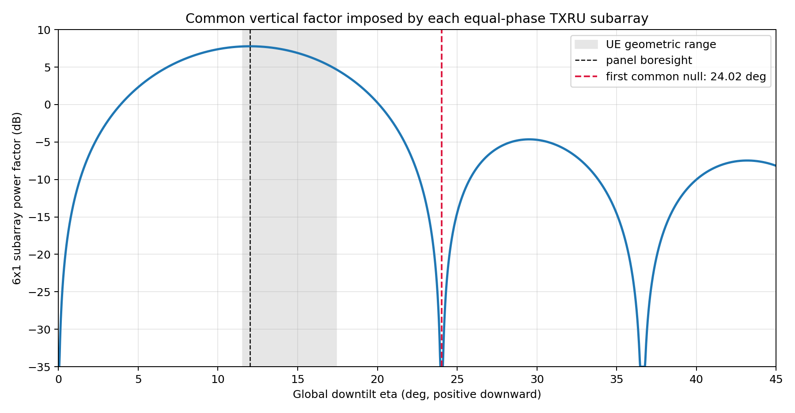
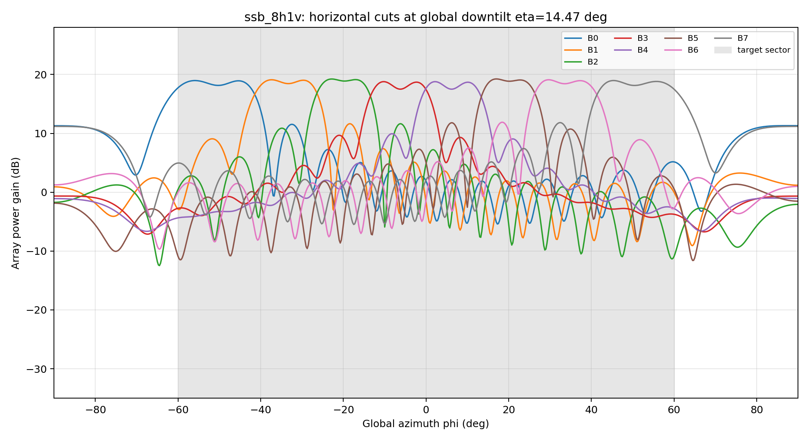
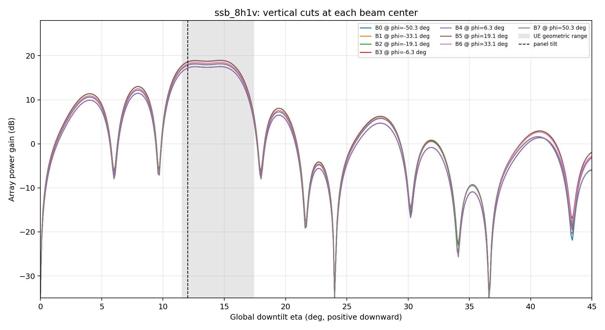
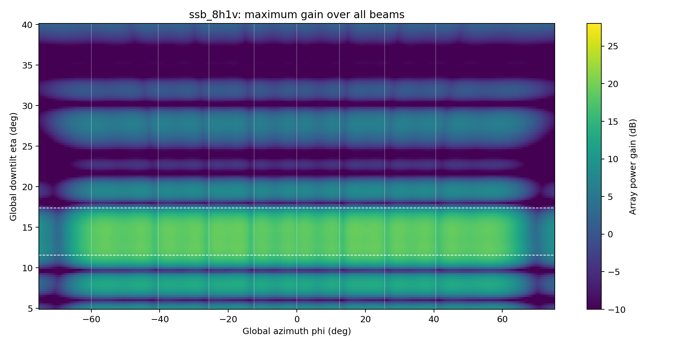
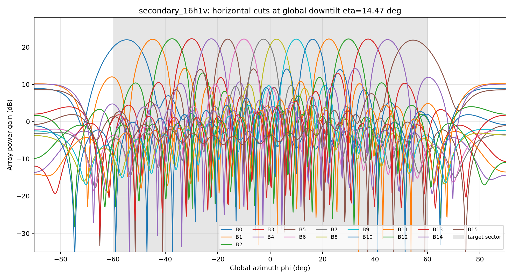
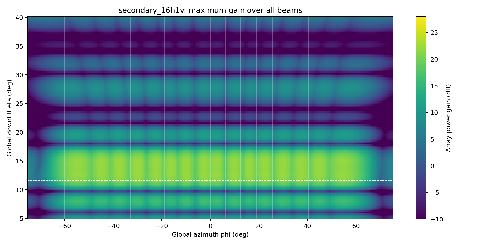
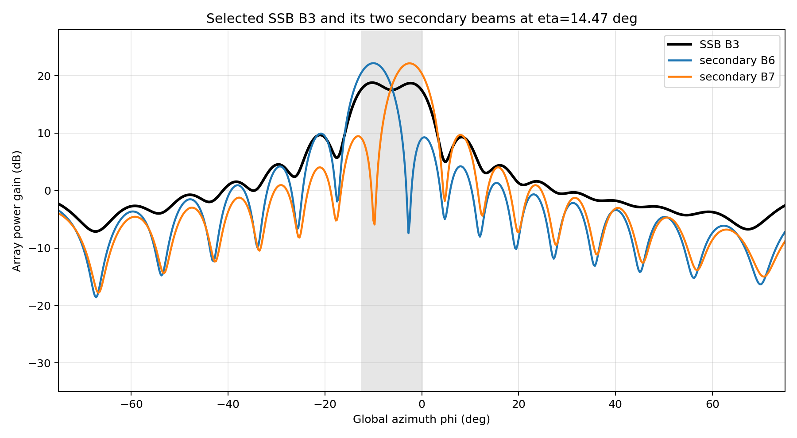

# SIB1 码本与方向图阶段审核报告

生成配置：`D:\07 2026\Simulation\SIB1_diversity\configs\experiments\plan-001.yaml`  
本报告覆盖平台基础功能调试的第一段：AE→TXRU 映射、8H×1V SSB 码本、16H×1V secondary 码本及方向图。尚未包含 UMa drop、NR 编解码或 BLER 结果。

## 1. 模型与坐标约定

- 单极化空间阵列为 24×16 AE、4×16 TXRU；每个 TXRU 连续连接 6×1 AE，等幅同相，映射列归一化。
- 双极化完整阵列共有 768 AE 和 128 个极化 TXRU 端口；本文方向图显示单极化空间阵列因子，双极化合成在后续预编码器阶段处理。
- 水平间距为 0.5λ，垂直间距为 0.8λ。
- 图中 φ 和 η 均为全局坐标；η 向下为正。局部角只在阵列响应内部按 `η_local = η_global - 12°` 计算，机械下倾只施加一次。
- UE 几何下倾覆盖为 11.549°～17.398°。
- 波束按全局方位角从负到正编号；secondary B(2b) 和 B(2b+1) 属于 SSB Bb。

## 2. 映射与数值检查

| 检查 | 结果 |
|---|---:|
| 单极化映射矩阵尺寸 | 384×64 |
| 每列非零 AE 数 | 6 |
| `max abs(F^H F-I)` | 2.220e-16 |
| SSB AE 权重范数最大偏差 | 2.776e-15 |
| Secondary AE 权重范数最大偏差 | 3.997e-15 |

`F^H F` 接近单位阵，表明连续子阵分组互不重叠且列功率归一化。TXRU 域投影与直接 AE 域响应的一致性由自动测试覆盖。

### 2.1 阻塞性发现：目标覆盖区内存在公共垂直零陷

每个 TXRU 的6个垂直 AE 等幅同相，其公共子阵因子为：

```text
A_sub(uV) = (1/sqrt(6)) * sum(m=0..5) exp(j*2*pi*m*dV*uV)
```

第一零点满足 `abs(sin(eta_local)) = 1/(6*dV)`。代入 `dV=0.8` 和12°机械下倾，向下侧第一公共零陷位于全局 η=24.025°，不在 UE 目标范围 11.549°～17.398° 内。



这是映射矩阵施加在所有 TXRU steering vector 上的公共乘法因子，因此调整 TXRU 数字码本、改用4H×2V布局或增加 weighted-LS 迭代均不能填平该零陷。当前目标角域的公共零陷检查判定为 **已避开公共零陷**。

## 3. SSB 8H×1V 方向图







SSB 目标区统计：全码本最低区内增益 1.33 dB，最大区内 ripple 17.92 dB。逐波束精确数值见 `beam_metrics.csv`。

## 4. Secondary 16H×1V 方向图





Secondary 目标区统计：全码本最低区内增益 4.13 dB，最大区内 ripple 18.10 dB。

## 5. Selected SSB 与子波束关系检查

以下使用 SSB B3 为固定审核示例，其子波束稳定映射为 secondary B6 和 B7。



## 6. 联合覆盖、交界与父子覆盖审核

审核网格覆盖全扇区 $\phi\in[-60^\circ,60^\circ]$ 和受控UE下倾范围 $\eta\in[11.549^\circ,17.398^\circ]$。

| 检查 | SSB 8H×1V | Secondary 16H×1V | 判定 |
|---|---:|---:|---|
| 全码本联合覆盖最低增益 | 3.98 dB | 6.02 dB | 通过，无覆盖孔洞 |
| 相邻波束交界最低联合增益 | 5.28 dB | 5.98 dB | 通过，交界无额外深陷 |
| 目标区公共垂直零陷 | 无 | 无 | 通过 |

对每个SSB父区域，计算其两个secondary的逐点最大增益。8组父子关系在全部审核网格点均满足“子波束联合增益不低于父SSB增益”；最小裕量约0.17 dB。因此两个secondary能够联合覆盖相应父SSB区域，父子编号映射通过。

逐波束矩形区域最大ripple约18 dB主要包含边缘/角点滚降，不等同于联合覆盖存在18 dB孔洞。研究者已明确接受该边缘滚降。

**审核结论：通过。码本于2026-09-13冻结，可用于Plan 001。** 冻结权重SHA-256：`3142396469049e843e8018bc5596152aa70d53e46d18b406879b52cf54638259`。

## 7. 冻结约束

- 波束编号、全局角度、机械下倾和父子码本关系已固化在 `codebook_metadata.json`。
- 复权重和固定映射保存在 `codebook_weights.npz`。后续四种方案必须复用这些离线权重，不允许读取当前 drop 的瞬时 AOD 重算码本。
- 当前图仅为阵列因子，尚未叠加 3GPP 单元方向图；接入 Sionna 38.901 天线模型时需确认单元增益和极化场分量，避免重复施加面板姿态。
- Plan 001必须读取本目录冻结的 `codebook_weights.npz`，并校验上述SHA-256；不得重新综合或覆盖该文件。
- 若后续改变weighted-LS、目标角域、阵列、下倾或码本权重，必须建立新的实验plan和冻结记录。

## 8. 产物清单

- `codebook_weights.npz`：映射矩阵、SSB/secondary 的 TXRU 与 AE 权重
- `codebook_metadata.json`：坐标、编号、区域和归一化约定
- `beam_metrics.csv`：逐波束目标区增益、ripple、区外增益和范数
- `*.png`：本报告引用的方向图
