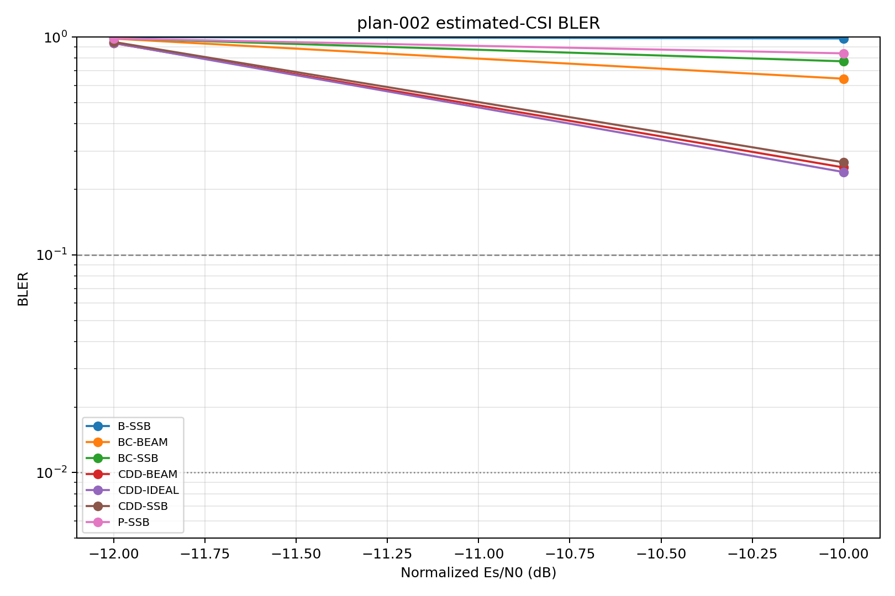
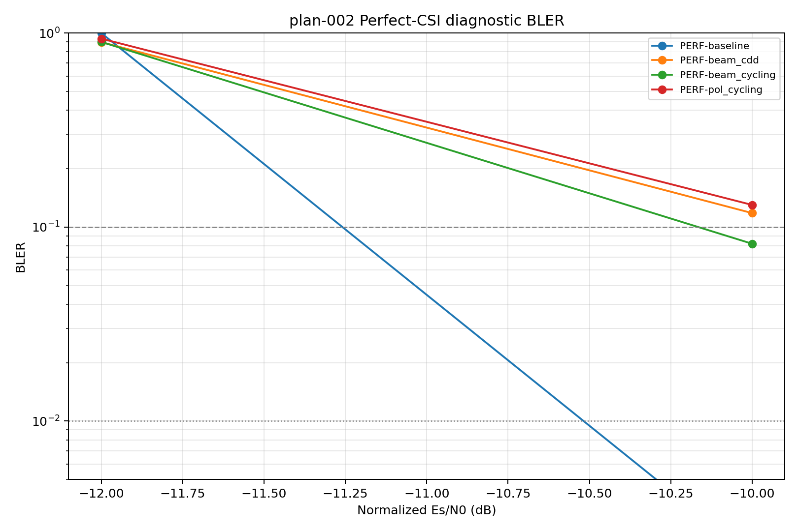
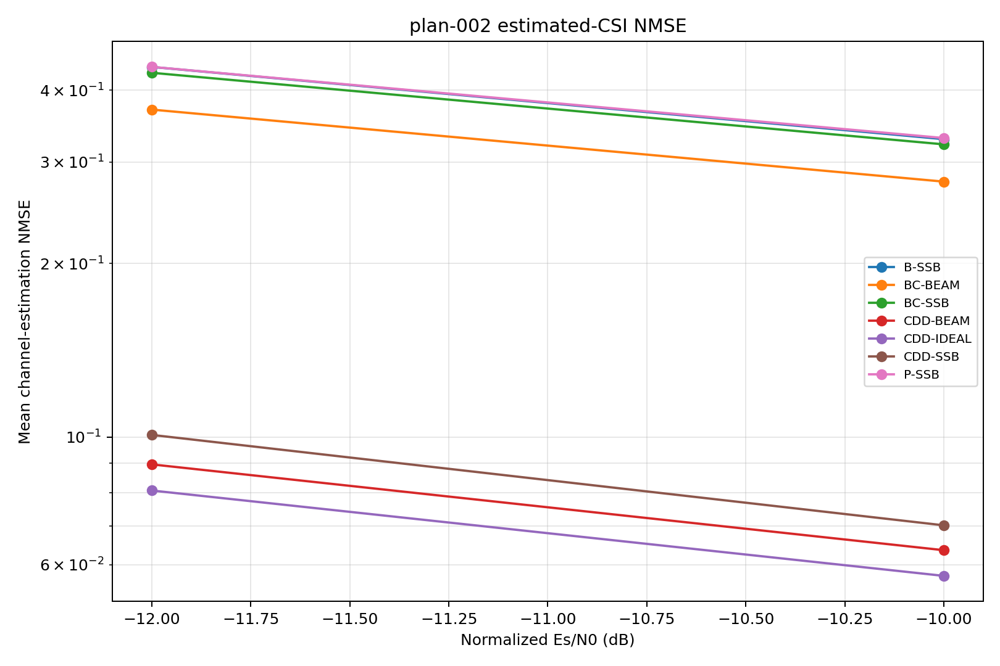
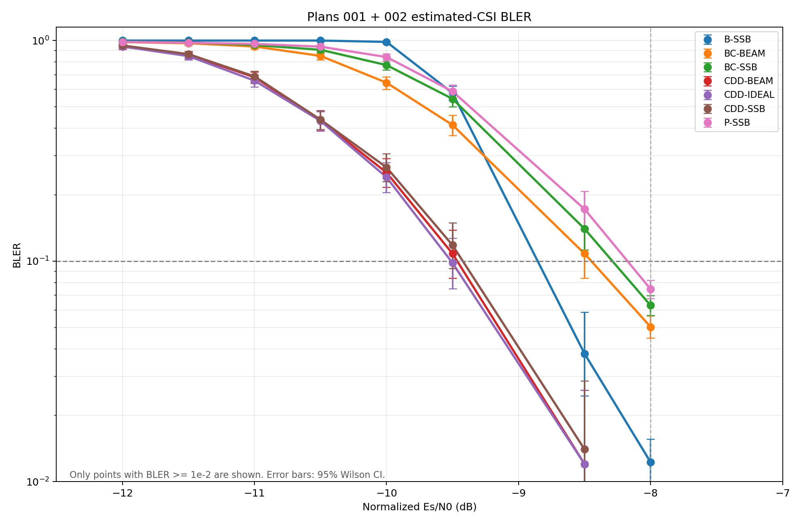
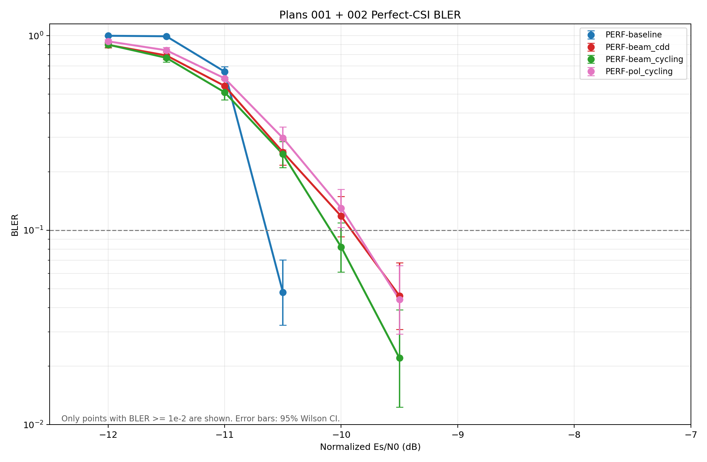
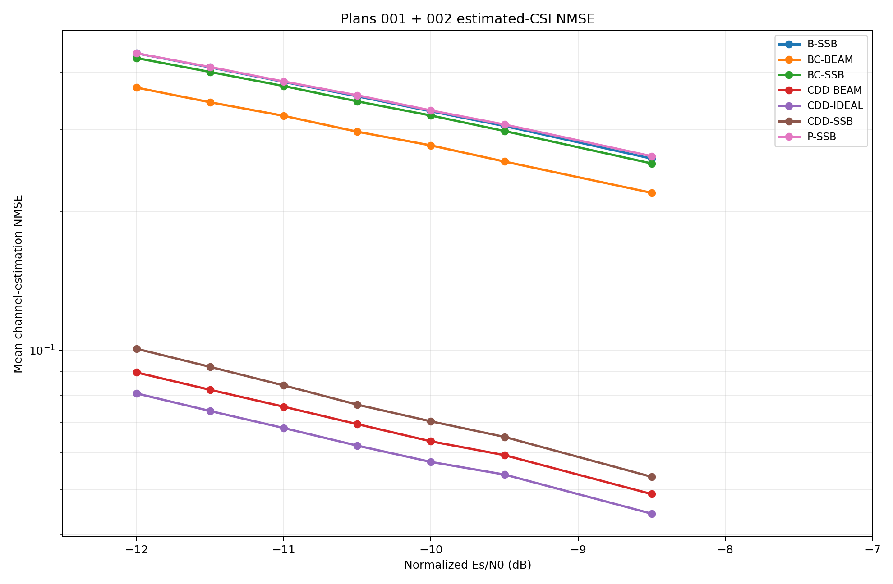

# Result 002：−12至−8 dB固定SNR扫描

状态：已完成

对应计划：[plan-002.md](plan-002.md)

完成日期：2026-09-15

## 1. 实际运行信息

- 运行命令：`.\run_plan002.ps1 -RunId run-001`
- 输出目录：`outputs/plan-002/run-001/`
- 开始/结束时间：2026-09-14 20:24:50 / 23:17:48（Asia/Singapore）
- 完成状态：−10 dB和−12 dB均完成500个公共drop，固定曲线运行正常结束
- Python / TensorFlow / Sionna：3.11.9 / 2.15.1 / 1.0.2
- 展开配置：`outputs/plan-002/run-001/resolved_config.yaml`
- 环境记录：`outputs/plan-002/run-001/environment.json`
- 运行元数据：`outputs/plan-002/run-001/run_metadata.json`
- 配置SHA-256：`45c0b6d61f913fbd0d963cd293be44fb08757bc9b8d6af00e82f5994c09e462e`
- 冻结码本SHA-256：`3142396469049e843e8018bc5596152aa70d53e46d18b406879b52cf54638259`
- 代码版本：当前工作区不是Git仓库，无法记录commit；以上配置和码本哈希作为本次可追溯标识
- 相对plan的偏差：未发现；SNR顺序、drop数、主种子和随机流命名空间均与plan一致

追加运行 `run-002`：

- 运行命令：`.\run_plan002.ps1 -RunId run-002`
- 输出目录：`outputs/plan-002/run-002/`
- 开始/结束时间：2026-09-15 15:49:03 / 15:52:58（Asia/Singapore）
- 完成状态：−11.5、−11、−10.5、−9.5和−8.5 dB均完成500个公共drop
- 展开配置：`outputs/plan-002/run-002/resolved_config.yaml`
- 配置SHA-256：`84dd14f598f748c7f3c3702e0a5370fc39ba0bdb93fe6c1175bb40c4c608bb3d`
- SNR随机流索引：−11.5、−11、−10.5、−9.5、−8.5 dB分别为1、2、3、5、7，无碰撞

```powershell
.\run_plan002.ps1 -RunId run-001
```

## 2. BLER与NMSE结果

### 2.1 Estimated-CSI主曲线

| SNR (dB) | 曲线 | 误块/总块 | BLER | 95% Wilson区间 |
|---:|---|---:|---:|---:|
| −12 | B-SSB | 500/500 | 1.000 | [0.9924, 1.0000] |
| −12 | P-SSB | 493/500 | 0.986 | [0.9714, 0.9932] |
| −12 | BC-SSB | 494/500 | 0.988 | [0.9741, 0.9945] |
| −12 | BC-BEAM | 492/500 | 0.984 | [0.9687, 0.9919] |
| −12 | CDD-SSB | 475/500 | 0.950 | [0.9272, 0.9659] |
| −12 | CDD-BEAM | 469/500 | 0.938 | [0.9133, 0.9560] |
| −12 | CDD-IDEAL | 470/500 | 0.940 | [0.9156, 0.9577] |
| −10 | B-SSB | 493/500 | 0.986 | [0.9714, 0.9932] |
| −10 | P-SSB | 421/500 | 0.842 | [0.8074, 0.8713] |
| −10 | BC-SSB | 387/500 | 0.774 | [0.7353, 0.8085] |
| −10 | BC-BEAM | 322/500 | 0.644 | [0.6011, 0.6847] |
| −10 | CDD-SSB | 133/500 | 0.266 | [0.2292, 0.3064] |
| −10 | CDD-BEAM | 126/500 | 0.252 | [0.2159, 0.2918] |
| −10 | CDD-IDEAL | 120/500 | 0.240 | [0.2046, 0.2793] |

### 2.2 Perfect-CSI诊断曲线

| SNR (dB) | 曲线 | 误块/总块 | BLER | 95% Wilson区间 |
|---:|---|---:|---:|---:|
| −12 | PERF-baseline | 500/500 | 1.000 | [0.9924, 1.0000] |
| −12 | PERF-pol_cycling | 468/500 | 0.936 | [0.9110, 0.9543] |
| −12 | PERF-beam_cycling | 450/500 | 0.900 | [0.8706, 0.9233] |
| −12 | PERF-beam_cdd | 449/500 | 0.898 | [0.8684, 0.9216] |
| −10 | PERF-baseline | 1/500 | 0.002 | [0.0004, 0.0112] |
| −10 | PERF-pol_cycling | 65/500 | 0.130 | [0.1033, 0.1623] |
| −10 | PERF-beam_cycling | 41/500 | 0.082 | [0.0610, 0.1094] |
| −10 | PERF-beam_cdd | 59/500 | 0.118 | [0.0926, 0.1492] |

### 2.3 Estimated-CSI追加结果

| SNR (dB) | 曲线 | 误块/总块 | BLER | 95% Wilson区间 |
|---:|---|---:|---:|---:|
| -11.5 | B-SSB | 500/500 | 1.0000 | [0.9924, 1.0000] |
| -11.5 | BC-BEAM | 486/500 | 0.9720 | [0.9536, 0.9832] |
| -11.5 | BC-SSB | 490/500 | 0.9800 | [0.9636, 0.9891] |
| -11.5 | CDD-BEAM | 431/500 | 0.8620 | [0.8290, 0.8895] |
| -11.5 | CDD-IDEAL | 425/500 | 0.8500 | [0.8160, 0.8786] |
| -11.5 | CDD-SSB | 434/500 | 0.8680 | [0.8355, 0.8949] |
| -11.5 | P-SSB | 489/500 | 0.9780 | [0.9610, 0.9877] |
| -11 | B-SSB | 500/500 | 1.0000 | [0.9924, 1.0000] |
| -11 | BC-BEAM | 470/500 | 0.9400 | [0.9156, 0.9577] |
| -11 | BC-SSB | 477/500 | 0.9540 | [0.9319, 0.9692] |
| -11 | CDD-BEAM | 341/500 | 0.6820 | [0.6399, 0.7213] |
| -11 | CDD-IDEAL | 329/500 | 0.6580 | [0.6154, 0.6982] |
| -11 | CDD-SSB | 344/500 | 0.6880 | [0.6461, 0.7270] |
| -11 | P-SSB | 483/500 | 0.9660 | [0.9462, 0.9787] |
| -10.5 | B-SSB | 500/500 | 1.0000 | [0.9924, 1.0000] |
| -10.5 | BC-BEAM | 426/500 | 0.8520 | [0.8182, 0.8804] |
| -10.5 | BC-SSB | 454/500 | 0.9080 | [0.8795, 0.9303] |
| -10.5 | CDD-BEAM | 217/500 | 0.4340 | [0.3912, 0.4778] |
| -10.5 | CDD-IDEAL | 216/500 | 0.4320 | [0.3893, 0.4758] |
| -10.5 | CDD-SSB | 219/500 | 0.4380 | [0.3951, 0.4818] |
| -10.5 | P-SSB | 469/500 | 0.9380 | [0.9133, 0.9560] |
| -9.5 | B-SSB | 289/500 | 0.5780 | [0.5343, 0.6205] |
| -9.5 | BC-BEAM | 207/500 | 0.4140 | [0.3716, 0.4577] |
| -9.5 | BC-SSB | 272/500 | 0.5440 | [0.5002, 0.5872] |
| -9.5 | CDD-BEAM | 54/500 | 0.1080 | [0.0837, 0.1383] |
| -9.5 | CDD-IDEAL | 49/500 | 0.0980 | [0.0749, 0.1272] |
| -9.5 | CDD-SSB | 59/500 | 0.1180 | [0.0926, 0.1492] |
| -9.5 | P-SSB | 294/500 | 0.5880 | [0.5443, 0.6303] |
| -8.5 | B-SSB | 19/500 | 0.0380 | [0.0245, 0.0586] |
| -8.5 | BC-BEAM | 54/500 | 0.1080 | [0.0837, 0.1383] |
| -8.5 | BC-SSB | 70/500 | 0.1400 | [0.1123, 0.1732] |
| -8.5 | CDD-BEAM | 6/500 | 0.0120 | [0.0055, 0.0259] |
| -8.5 | CDD-IDEAL | 6/500 | 0.0120 | [0.0055, 0.0259] |
| -8.5 | CDD-SSB | 7/500 | 0.0140 | [0.0068, 0.0286] |
| -8.5 | P-SSB | 86/500 | 0.1720 | [0.1415, 0.2075] |

### 2.4 Perfect-CSI追加结果

| SNR (dB) | 曲线 | 误块/总块 | BLER | 95% Wilson区间 |
|---:|---|---:|---:|---:|
| -11.5 | PERF-baseline | 497/500 | 0.9940 | [0.9825, 0.9980] |
| -11.5 | PERF-beam_cdd | 396/500 | 0.7920 | [0.7543, 0.8253] |
| -11.5 | PERF-beam_cycling | 385/500 | 0.7700 | [0.7311, 0.8047] |
| -11.5 | PERF-pol_cycling | 421/500 | 0.8420 | [0.8074, 0.8713] |
| -11 | PERF-baseline | 327/500 | 0.6540 | [0.6113, 0.6944] |
| -11 | PERF-beam_cdd | 276/500 | 0.5520 | [0.5082, 0.5950] |
| -11 | PERF-beam_cycling | 256/500 | 0.5120 | [0.4683, 0.5556] |
| -11 | PERF-pol_cycling | 302/500 | 0.6040 | [0.5605, 0.6459] |
| -10.5 | PERF-baseline | 24/500 | 0.0480 | [0.0325, 0.0704] |
| -10.5 | PERF-beam_cdd | 126/500 | 0.2520 | [0.2159, 0.2918] |
| -10.5 | PERF-beam_cycling | 123/500 | 0.2460 | [0.2103, 0.2856] |
| -10.5 | PERF-pol_cycling | 149/500 | 0.2980 | [0.2596, 0.3395] |
| -9.5 | PERF-baseline | 0/500 | 0.0000 | [0.0000, 0.0076] |
| -9.5 | PERF-beam_cdd | 23/500 | 0.0460 | [0.0308, 0.0681] |
| -9.5 | PERF-beam_cycling | 11/500 | 0.0220 | [0.0123, 0.0390] |
| -9.5 | PERF-pol_cycling | 22/500 | 0.0440 | [0.0292, 0.0657] |
| -8.5 | PERF-baseline | 0/500 | 0.0000 | [0.0000, 0.0076] |
| -8.5 | PERF-beam_cdd | 2/500 | 0.0040 | [0.0011, 0.0145] |
| -8.5 | PERF-beam_cycling | 1/500 | 0.0020 | [0.0004, 0.0112] |
| -8.5 | PERF-pol_cycling | 0/500 | 0.0000 | [0.0000, 0.0076] |

### 2.5 曲线

Plan 002原始曲线：







Plan 001、Plan 002 `run-001`和新增`run-002`合并后的曲线：







合并BLER图使用Plan 002 `run-001`的−12/−10 dB、`run-002`的五个半dB点，以及Plan 001的−8 dB阶段性点。横轴显示至−7 dB；只绘制BLER不低于$10^{-2}$的点，低于$10^{-2}$的点不显示。误差棒为95% Wilson区间。NMSE图采用相同的−12.5～−7 dB横轴范围。

## 3. 实现检查与有效性

- CDD实际配置为2个波束，循环移位为`[0, 3.5555556]` FFT samples，即`[0, 57.870370 ns]`，相位分母为576。
- 展开配置和运行元数据确认逐占用子载波单位范数、公共selected-SSB归一化，以及方案间共用UE drop、TB、物理信道和单位方差噪声。
- 两次运行的`paired_counts.csv`均为每个SNR 21个estimated-CSI曲线对；`run-002`共105行，每行`n00+n01+n10+n11=500`。
- 完整性检查通过：`run-002`有55行BLER、35行NMSE和105行配对计数；合并文件有132行BLER和77行NMSE。SNR/曲线键无重复，数值有限，误块数和总块数一致，无NaN/Inf。
- 2026-09-15重新执行配置验证通过；相关CDD、接收机、公共归一化和fixed-run测试共13项通过。
- 常规正式输出没有单独保存逐drop预编码功率谱，因此运行后只能由展开配置、实现测试和有限输出检查追溯归一化，不能逐drop复核完整功率谱。

有效性结论：原始两点和追加五点均完成各自固定500-drop条件，可用于绘制过渡区预览并决定后续SNR采样；它仍是`preliminary`结果，不能替代目标交越附近的最终自适应统计。

## 4. 结论与后续采样点

- −12 dB时七条estimated-CSI曲线BLER均不低于0.938，已接近饱和，无需增加−14 dB。
- CDD三条曲线在−9.5 dB的BLER为0.098～0.118，且Wilson区间均跨过$10^{-1}$，说明其$10^{-1}$交越就在−9.5 dB附近。
- B-SSB在−9.5/−8.5 dB为0.578/0.038，因此其$10^{-1}$交越位于这两个点之间。P-SSB和BC-SSB在−8.5 dB仍为0.172和0.140，到Plan 001的−8 dB降至0.0746和0.0629，因此其$10^{-1}$交越位于−8.5～−8 dB。
- CDD三条曲线在−8.5 dB为0.012～0.014，Wilson区间跨过$10^{-2}$；Plan 001的−8 dB为0.00459～0.00516。因此CDD的$10^{-2}$交越位于−8.5～−8 dB，但500 drops不足以精确定位。
- B/P/BC的$10^{-2}$交越仍需在−8 dB以上补点；优先考虑−7.5或−7 dB。所有固定500-drop点只支持过渡趋势和粗略区间，最终差异仍应依据更高误块数和配对统计。

## 5. 输出和复现

- BLER：`outputs/plan-002/run-001/bler.csv`
- NMSE：`outputs/plan-002/run-001/nmse.csv`
- 配对计数：`outputs/plan-002/run-001/paired_counts.csv`
- 追加BLER：`outputs/plan-002/run-002/bler.csv`
- 追加NMSE：`outputs/plan-002/run-002/nmse.csv`
- 追加配对计数：`outputs/plan-002/run-002/paired_counts.csv`
- 追加展开配置：`outputs/plan-002/run-002/resolved_config.yaml`
- 追加环境和元数据：`outputs/plan-002/run-002/environment.json`、`run_metadata.json`
- 合并BLER数据：`outputs/plan-002/run-001/combined_plan001_plan002/bler_combined.csv`
- 合并NMSE数据：`outputs/plan-002/run-001/combined_plan001_plan002/nmse_combined.csv`
- 展开配置：`outputs/plan-002/run-001/resolved_config.yaml`
- 环境：`outputs/plan-002/run-001/environment.json`
- 运行元数据：`outputs/plan-002/run-001/run_metadata.json`
- 日志：`outputs/plan-002/run-001/run.log`

复现Plan 002：

```powershell
.\run_plan002.ps1 -RunId <new-run-id>
```
