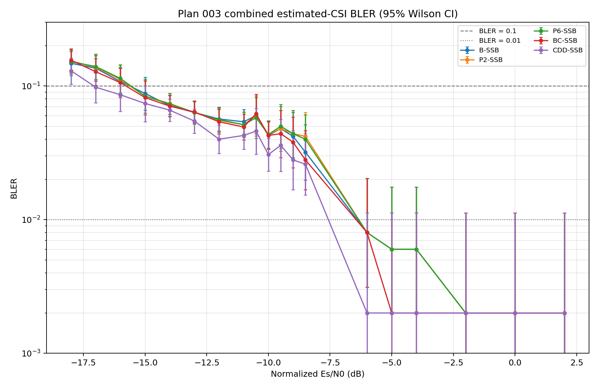
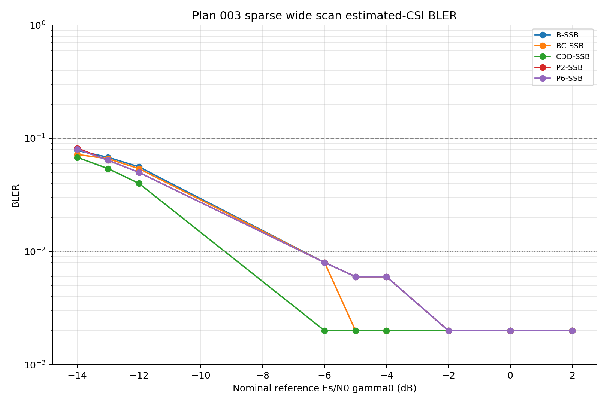
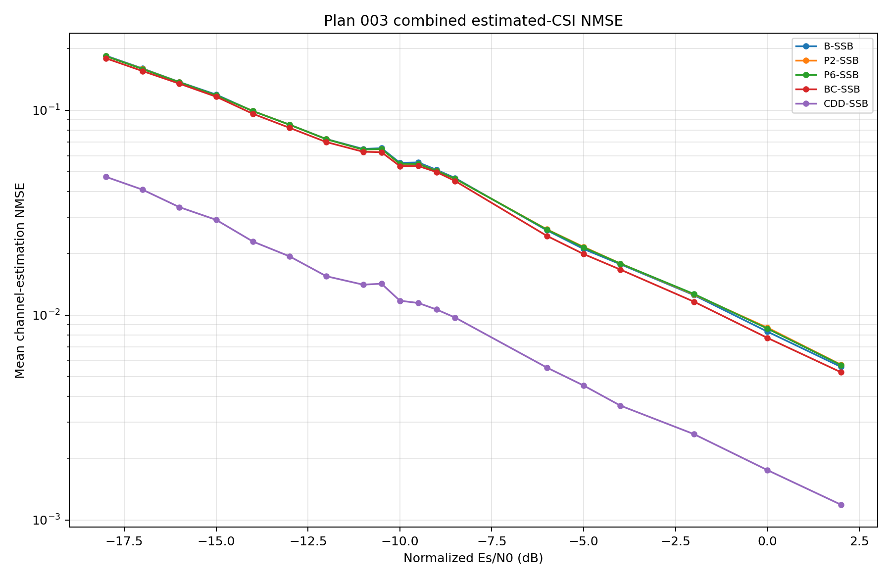
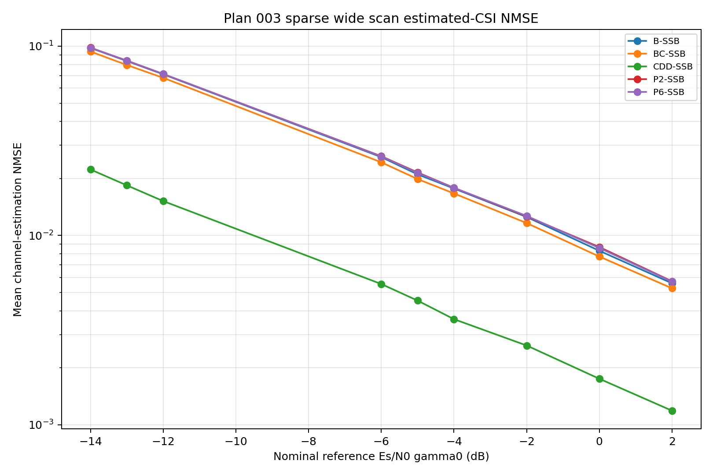

# Result 003：固定半径CSI与Pol-PRG对比

状态：未完成（estimated主曲线、稀疏宽扫和平滑追加已完成；ideal仅完成4/7个SNR点）

对应计划：[plan-003.md](./plan-003.md)

结果整理日期：2026-09-18

## 1. 实际运行信息

| 项目 | 实际值 |
|---|---|
| 代码版本/状态 | 当前目录不是Git工作树，无法恢复提交号；本结果以展开配置、环境文件和CSV为准 |
| Python/TensorFlow/Sionna | 3.11.9 / 2.15.1 / 1.0.2；NumPy 1.26.4，PyYAML 6.0 |
| 主运行配置 | `outputs/plan-003/run-001/{estimated,ideal}/resolved_config.yaml`；配置SHA-256 `66db6e18cbf9acf3ab66e3f3eb5fab195b7341b2a7c41488ac54e8eb3935ccd8` |
| 稀疏宽扫配置 | `outputs/plan-003/run-002/wide_2/resolved_config.yaml`；配置SHA-256 `9aa88b1840381cc15273f3c328d98acc989c5b092363b78c6bbf3fee8f7fb702` |
| 平滑追加配置 | `run-004/threshold`配置SHA-256 `56886cccb58a665eb6a50e785704947e95fd0b6f40e57273bbdd2788ed189030`；`run-004/core`配置SHA-256 `942dfd63dadbd78aa5b85275270d17125a2be8c05474d6d40623353c24bb64c6` |
| 输出目录 | `outputs/plan-003/run-001/{estimated,ideal}/`、`outputs/plan-003/run-002/wide_2/`、`outputs/plan-003/run-004/{threshold,core}/` |
| estimated时间 | 2026-09-15 23:31:55至2026-09-16 17:05:10（Asia/Singapore） |
| 稀疏宽扫时间 | 2026-09-16 18:47:07至2026-09-17 02:37:49（Asia/Singapore） |
| 废弃的平滑试运行 | 2026-09-17 09:46:29（Asia/Singapore）启动，09:50在−18 dB完成40/4000 drops后停止；`run-003/smooth`不纳入统计 |
| 缩减追加运行 | threshold：2026-09-17 10:31:15至14:27:49；core：2026-09-17 14:27:50至2026-09-18 00:02:01（Asia/Singapore） |
| 完成状态 | estimated 6/6点、稀疏宽扫9/9点、threshold 4/4点、core 5/5点完成；ideal仅完成−12、−11.5、−11、−10.5 dB，缺少−10、−9.5、−9 dB及完成元数据 |
| 与plan的偏差 | 稀疏宽扫实际目录为`wide_2`而非`wide`；另一台机器上的原始启动命令未保存在产物中；ideal提前停止；未输出独立的CDD原始功率谱文件 |

本机原运行入口及稀疏宽扫的等价复现命令如下。第二条显式指定`wide_2`，与收到的实际目录一致。

```powershell
.\run_plan003.ps1 -RunId run-001 -Phase estimated
.\run_plan003.ps1 -RunId run-001 -Phase ideal

$env:PYTHONPATH = Join-Path (Get-Location) 'src'
py -3.11 -m sib1div.cli simulate configs/experiments/plan-003-wide-scan-01.yaml `
  --codebook outputs/plan-001/codebook_7ghz_8h1v_mainlobe/codebook_weights.npz `
  --output outputs/plan-003/run-002/wide_2

.\run_plan003_append.ps1 -RunId run-004 -Batch all

$env:PYTHONPATH = Join-Path (Get-Location) 'src'
py -3.11 -m sib1div.analysis.merge_fixed_runs
```

Beam CDD实际参数：

| 参数 | 实际值 |
|---|---|
| 波束数 $K$ | 2；selected SSB的两个secondary子波束，全局索引为`[2s,2s+1]`；两个CDD时延网格索引为`[0,1]` |
| FFT大小和采样率 | 2048 / 61.44 Msps |
| 循环移位采样点 | `[0, 3.5555555556]` samples；活动带DFT网格索引`[0,1]`、模数576 |
| 对应循环移位时间 | `[0, 57.87037037]` ns |
| 频域相位 | $v_m[q]=\exp(-j2\pi qj_m/576)$，$q=0,\ldots,575$ |
| 功率归一化 | 每个活动子载波单位范数；运行时`assert_unit_norm`逐drop检查 |

## 2. BLER结果

表格单元格式为“误块数/总块数；BLER [95% Wilson区间]”。

### 2.1 稀疏宽扫追加结果（主要新增结果）

| SNR/dB | B-SSB | P2-SSB | P6-SSB | BC-SSB | CDD-SSB |
|---:|---:|---:|---:|---:|---:|
| -14 | 39/500; 0.078 [0.0576, 0.1049] | 41/500; 0.082 [0.0610, 0.1094] | 40/500; 0.080 [0.0593, 0.1071] | 36/500; 0.072 [0.0525, 0.0981] | 34/500; 0.068 [0.0491, 0.0935] |
| -13 | 34/500; 0.068 [0.0491, 0.0935] | 32/500; 0.064 [0.0457, 0.0890] | 32/500; 0.064 [0.0457, 0.0890] | 33/500; 0.066 [0.0474, 0.0912] | 27/500; 0.054 [0.0374, 0.0774] |
| -12 | 28/500; 0.056 [0.0390, 0.0797] | 25/500; 0.050 [0.0341, 0.0728] | 25/500; 0.050 [0.0341, 0.0728] | 27/500; 0.054 [0.0374, 0.0774] | 20/500; 0.040 [0.0260, 0.0610] |
| -6 | 4/500; 0.008 [0.0031, 0.0204] | 4/500; 0.008 [0.0031, 0.0204] | 4/500; 0.008 [0.0031, 0.0204] | 4/500; 0.008 [0.0031, 0.0204] | 1/500; 0.002 [0.0004, 0.0112] |
| -5 | 3/500; 0.006 [0.0020, 0.0175] | 3/500; 0.006 [0.0020, 0.0175] | 3/500; 0.006 [0.0020, 0.0175] | 1/500; 0.002 [0.0004, 0.0112] | 1/500; 0.002 [0.0004, 0.0112] |
| -4 | 3/500; 0.006 [0.0020, 0.0175] | 3/500; 0.006 [0.0020, 0.0175] | 3/500; 0.006 [0.0020, 0.0175] | 1/500; 0.002 [0.0004, 0.0112] | 1/500; 0.002 [0.0004, 0.0112] |
| -2 | 1/500; 0.002 [0.0004, 0.0112] | 1/500; 0.002 [0.0004, 0.0112] | 1/500; 0.002 [0.0004, 0.0112] | 1/500; 0.002 [0.0004, 0.0112] | 1/500; 0.002 [0.0004, 0.0112] |
| 0 | 1/500; 0.002 [0.0004, 0.0112] | 1/500; 0.002 [0.0004, 0.0112] | 1/500; 0.002 [0.0004, 0.0112] | 1/500; 0.002 [0.0004, 0.0112] | 1/500; 0.002 [0.0004, 0.0112] |
| 2 | 1/500; 0.002 [0.0004, 0.0112] | 1/500; 0.002 [0.0004, 0.0112] | 1/500; 0.002 [0.0004, 0.0112] | 1/500; 0.002 [0.0004, 0.0112] | 1/500; 0.002 [0.0004, 0.0112] |

### 2.2 平滑追加后的关键合并结果

下表已将不重叠的绝对drop区间合并：`run-001/estimated`为0–499，`run-002/wide_2`为500–999，`run-004`为1000–1499或1000–1999。表格单元格式不变。

| SNR/dB | B-SSB | P2-SSB | P6-SSB | BC-SSB | CDD-SSB |
|---:|---:|---:|---:|---:|---:|
| -18 | 74/500; 0.148 [0.1196, 0.1818] | 77/500; 0.154 [0.1250, 0.1883] | 76/500; 0.152 [0.1232, 0.1861] | 78/500; 0.156 [0.1268, 0.1904] | 65/500; 0.130 [0.1033, 0.1623] |
| -17 | 68/500; 0.136 [0.1087, 0.1688] | 69/500; 0.138 [0.1105, 0.1710] | 70/500; 0.140 [0.1123, 0.1732] | 64/500; 0.128 [0.1015, 0.1601] | 49/500; 0.098 [0.0749, 0.1272] |
| -16 | 54/500; 0.108 [0.0837, 0.1383] | 56/500; 0.112 [0.0873, 0.1427] | 57/500; 0.114 [0.0890, 0.1448] | 53/500; 0.106 [0.0820, 0.1361] | 43/500; 0.086 [0.0645, 0.1138] |
| -15 | 44/500; 0.088 [0.0662, 0.1161] | 42/500; 0.084 [0.0627, 0.1116] | 42/500; 0.084 [0.0627, 0.1116] | 41/500; 0.082 [0.0610, 0.1094] | 37/500; 0.074 [0.0542, 0.1003] |
| -14 | 107/1500; 0.0713 [0.0594, 0.0855] | 111/1500; 0.0740 [0.0618, 0.0884] | 110/1500; 0.0733 [0.0612, 0.0876] | 106/1500; 0.0707 [0.0588, 0.0848] | 99/1500; 0.0660 [0.0545, 0.0797] |
| -13 | 95/1500; 0.0633 [0.0521, 0.0768] | 95/1500; 0.0633 [0.0521, 0.0768] | 95/1500; 0.0633 [0.0521, 0.0768] | 96/1500; 0.0640 [0.0527, 0.0775] | 82/1500; 0.0547 [0.0443, 0.0673] |
| -12 | 85/1500; 0.0567 [0.0461, 0.0695] | 83/1500; 0.0553 [0.0449, 0.0681] | 84/1500; 0.0560 [0.0455, 0.0688] | 81/1500; 0.0540 [0.0437, 0.0666] | 60/1500; 0.0400 [0.0312, 0.0511] |
| -11 | 81/1500; 0.0540 [0.0437, 0.0666] | 77/1500; 0.0513 [0.0413, 0.0637] | 77/1500; 0.0513 [0.0413, 0.0637] | 74/1500; 0.0493 [0.0395, 0.0615] | 64/1500; 0.0427 [0.0336, 0.0541] |
| -10 | 64/1500; 0.0427 [0.0336, 0.0541] | 65/1500; 0.0433 [0.0341, 0.0549] | 65/1500; 0.0433 [0.0341, 0.0549] | 64/1500; 0.0427 [0.0336, 0.0541] | 46/1500; 0.0307 [0.0231, 0.0407] |

### 2.3 原estimated运行

| SNR/dB | B-SSB | P2-SSB | P6-SSB | BC-SSB | BC-BEAM | CDD-SSB | CDD-BEAM | CDD-IDEAL |
|---:|---:|---:|---:|---:|---:|---:|---:|---:|
| -11 | 35/500; 0.070 [0.0508, 0.0958] | 32/500; 0.064 [0.0457, 0.0890] | 32/500; 0.064 [0.0457, 0.0890] | 33/500; 0.066 [0.0474, 0.0912] | 30/500; 0.060 [0.0423, 0.0844] | 27/500; 0.054 [0.0374, 0.0774] | 26/500; 0.052 [0.0357, 0.0751] | 27/500; 0.054 [0.0374, 0.0774] |
| -10.5 | 30/500; 0.060 [0.0423, 0.0844] | 30/500; 0.060 [0.0423, 0.0844] | 29/500; 0.058 [0.0407, 0.0821] | 31/500; 0.062 [0.0440, 0.0867] | 30/500; 0.060 [0.0423, 0.0844] | 23/500; 0.046 [0.0308, 0.0681] | 23/500; 0.046 [0.0308, 0.0681] | 23/500; 0.046 [0.0308, 0.0681] |
| -10 | 27/500; 0.054 [0.0374, 0.0774] | 26/500; 0.052 [0.0357, 0.0751] | 26/500; 0.052 [0.0357, 0.0751] | 27/500; 0.054 [0.0374, 0.0774] | 27/500; 0.054 [0.0374, 0.0774] | 18/500; 0.036 [0.0229, 0.0562] | 18/500; 0.036 [0.0229, 0.0562] | 18/500; 0.036 [0.0229, 0.0562] |
| -9.5 | 24/500; 0.048 [0.0325, 0.0704] | 24/500; 0.048 [0.0325, 0.0704] | 25/500; 0.050 [0.0341, 0.0728] | 22/500; 0.044 [0.0292, 0.0657] | 23/500; 0.046 [0.0308, 0.0681] | 18/500; 0.036 [0.0229, 0.0562] | 18/500; 0.036 [0.0229, 0.0562] | 18/500; 0.036 [0.0229, 0.0562] |
| -9 | 21/500; 0.042 [0.0276, 0.0634] | 22/500; 0.044 [0.0292, 0.0657] | 22/500; 0.044 [0.0292, 0.0657] | 19/500; 0.038 [0.0245, 0.0586] | 18/500; 0.036 [0.0229, 0.0562] | 14/500; 0.028 [0.0168, 0.0464] | 14/500; 0.028 [0.0168, 0.0464] | 14/500; 0.028 [0.0168, 0.0464] |
| -8.5 | 16/500; 0.032 [0.0198, 0.0513] | 21/500; 0.042 [0.0276, 0.0634] | 20/500; 0.040 [0.0260, 0.0610] | 14/500; 0.028 [0.0168, 0.0464] | 13/500; 0.026 [0.0153, 0.0440] | 13/500; 0.026 [0.0153, 0.0440] | 13/500; 0.026 [0.0153, 0.0440] | 13/500; 0.026 [0.0153, 0.0440] |

### 2.4 未完成的ideal运行

| SNR/dB | PERF-B | PERF-P2 | PERF-P6 | PERF-BC | PERF-CDD |
|---:|---:|---:|---:|---:|---:|
| -12 | 30/500; 0.060 [0.0423, 0.0844] | 28/500; 0.056 [0.0390, 0.0797] | 29/500; 0.058 [0.0407, 0.0821] | 32/500; 0.064 [0.0457, 0.0890] | 30/500; 0.060 [0.0423, 0.0844] |
| -11.5 | 27/500; 0.054 [0.0374, 0.0774] | 27/500; 0.054 [0.0374, 0.0774] | 26/500; 0.052 [0.0357, 0.0751] | 26/500; 0.052 [0.0357, 0.0751] | 27/500; 0.054 [0.0374, 0.0774] |
| -11 | 25/500; 0.050 [0.0341, 0.0728] | 23/500; 0.046 [0.0308, 0.0681] | 23/500; 0.046 [0.0308, 0.0681] | 24/500; 0.048 [0.0325, 0.0704] | 25/500; 0.050 [0.0341, 0.0728] |
| -10.5 | 23/500; 0.046 [0.0308, 0.0681] | 22/500; 0.044 [0.0292, 0.0657] | 22/500; 0.044 [0.0292, 0.0657] | 18/500; 0.036 [0.0229, 0.0562] | 20/500; 0.040 [0.0260, 0.0610] |

## 3. 曲线和信道估计

合并主图仅保留五条共同主曲线，并合并`run-001/estimated`、`run-002/wide_2`和`run-004/{threshold,core}`。重叠SNR点累加误块数和blocks后重新计算95% Wilson区间；NMSE按blocks加权；配对四格计数逐项累加。折线只是离散采样点的视觉引导，不表示在稀疏区间内进行了插值仿真。









合并后，CDD-SSB的平均NMSE在−14、−12、−10 dB分别约为0.0229、0.0151、0.0123；同期B-SSB约为0.0991、0.0708、0.0578，CDD-SSB分别低约4.33、4.68和4.71倍。P2-SSB与P6-SSB的NMSE几乎重合，BC-SSB仅比B-SSB略低。

## 4. 实现检查与有效性

- `wide_2`的`bler.csv`为45行、`nmse.csv`为45行、`paired_counts.csv`为90行；每个SNR和每条曲线均为500 blocks。
- `run-004/threshold`的BLER/NMSE各20行、配对计数40行，每点500 blocks；`run-004/core`的BLER/NMSE各25行、配对计数50行，每点1000 blocks。
- threshold与core的完成元数据、配置哈希、SNR列表和drop区间均与plan一致；两个批次分别正常结束于2026-09-17T06:27:49Z和2026-09-17T16:02:01Z。
- 所有`bler`、Wilson区间和NMSE字段均为有限值；日志记录正常完成，未见NaN、Inf、协方差求解失败或异常终止。
- 原始批次和合并输出的每个配对计数均满足`n00+n01+n10+n11=blocks`，说明五条曲线使用了同一批公共drop并保留了可追溯的配对统计。
- 展开配置中的主种子为20260913，绝对drop范围为500–999，与原运行0–499不重叠；UE、TB、信道和噪声均配置为方案间共用。
- 收到的宽扫配置SHA-256与本地`configs/experiments/plan-003-wide-scan-01.yaml`一致；冻结码本SHA-256为`3142396469049e843e8018bc5596152aa70d53e46d18b406879b52cf54638259`。
- CDD使用网格索引`[0,1]`和576分母，发射路径在每个drop调用单位范数断言。正式输出未保存`record_raw_precoder_power_spectrum`所暗示的独立功率谱CSV，因此只能确认归一化断言通过，不能从本次输出独立复核原始功率谱。
- 合并输出含95行BLER、95行NMSE和190行配对计数，对应19个SNR×5条主曲线；合并CSV含`source_runs`列，`merge_manifest.json`记录输入、排除项、合并方法和输出哈希。
- 合并工具明确排除`run-003/smooth`，避免把废弃试运行的40个drop混入正式统计。

有效性结论：**estimated-CSI主结果有效，完整Plan 003仍未完成**。主运行、稀疏宽扫和平滑追加均满足预定的计数、配置、公共样本、有限性和可追溯性条件；但仍缺3个ideal SNR点、ideal完成元数据以及独立CDD原始功率谱输出。

## 5. 结论

1. threshold批次把BLER 0.1交越区定位出来：B/P2/P6/BC的点估计在−16至−15 dB之间跨过0.1，CDD-SSB在−18至−17 dB之间跨过0.1。相邻点Wilson区间仍有重叠，因此这里只报告交越区间，不给出精确SNR增益。
2. 平滑合并后，CDD-SSB在−14、−13、−12、−11、−10 dB的BLER分别为0.0660、0.0547、0.0400、0.0427、0.0307，均低于B-SSB的0.0713、0.0633、0.0567、0.0540、0.0427。方向与CDD低约4.3–4.7倍的NMSE一致，但BLER区间多数仍重叠。
3. P2-SSB与P6-SSB在1500-drop核心点几乎没有差别，误块数相同或只差1块；当前数据不支持PRG=6相对PRG=2有可确认收益。
4. BC-SSB相对B-SSB只有小幅、且不稳定的点估计改善；−2、0、2 dB处五条曲线都只有1个公共错误。这里反映的是500 drops下的计数分辨率和公共难例，不能据此认定存在0.002的物理误码地板。
5. 已完成的四个Perfect-CSI点中，各方案差异很小且没有一致排序；由于ideal运行未完成，不能用它给出传输分集的最终上界结论。

## 6. 输出和复现

- 稀疏宽扫BLER：`outputs/plan-003/run-002/wide_2/bler.csv`（SHA-256 `161dbe75da88e4326dbeda82ec3275d5cf76d3ff972b0bd01427400a19af90d1`）
- 稀疏宽扫NMSE：`outputs/plan-003/run-002/wide_2/nmse.csv`（SHA-256 `8bf7a033698a1dd81beabcb68a43a2578cd124d6b8d317ce828e69a834bf04d4`）
- 稀疏宽扫配对计数：`outputs/plan-003/run-002/wide_2/paired_counts.csv`（SHA-256 `3eadcf5473bc5a44e65ca09379cb862c04bb579b6a6c415c4cd59de192349a49`）
- 平滑追加原始输出：`outputs/plan-003/run-004/{threshold,core}/`
- 合并BLER：`outputs/plan-003/result-003/estimated-primary-combined/bler.csv`（SHA-256 `44c7c265d98df625f2dcba3383abdac656542ff7d6a6899836fc92c17332a32a`）
- 合并NMSE：`outputs/plan-003/result-003/estimated-primary-combined/nmse.csv`（SHA-256 `74b3987d1ff5771869aaa5a70dcc5e8ef64adee141bff20876be795cc64189a5`）
- 合并配对计数：`outputs/plan-003/result-003/estimated-primary-combined/paired_counts.csv`（SHA-256 `fcee74f139fbcdff198380bd67a1c82e0a51e67cd505495436e4c8e39c389b24`）
- 合并图片和清单：`outputs/plan-003/result-003/estimated-primary-combined/{bler.png,nmse.png,merge_manifest.json}`
- 本次配置复验输出：`outputs/plan-003/result-003/config-validation/`
- 展开配置、环境和元数据：`outputs/plan-003/run-002/wide_2/{resolved_config.yaml,environment.json,run_metadata.json}`
- 日志：`outputs/plan-003/run-002/wide_2/run.log`

若继续完成本计划，应使用原`run-001/ideal`目录恢复运行，以保留已有checkpoint和0–499绝对drop区间：

```powershell
.\run_plan003.ps1 -RunId run-001 -Phase ideal
```
