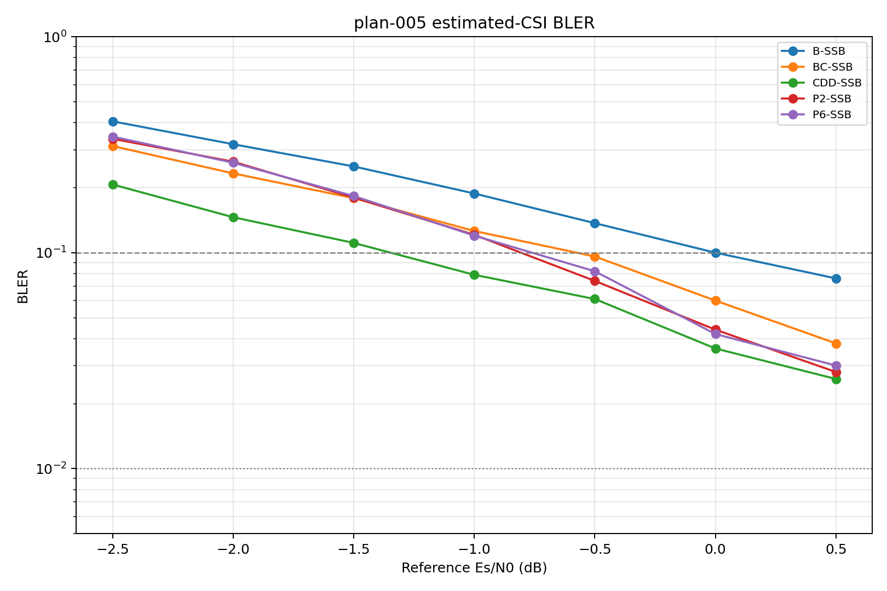
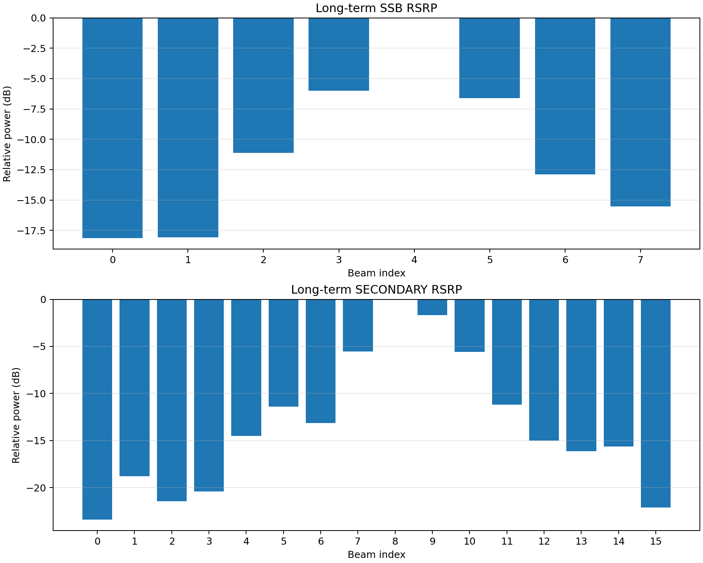
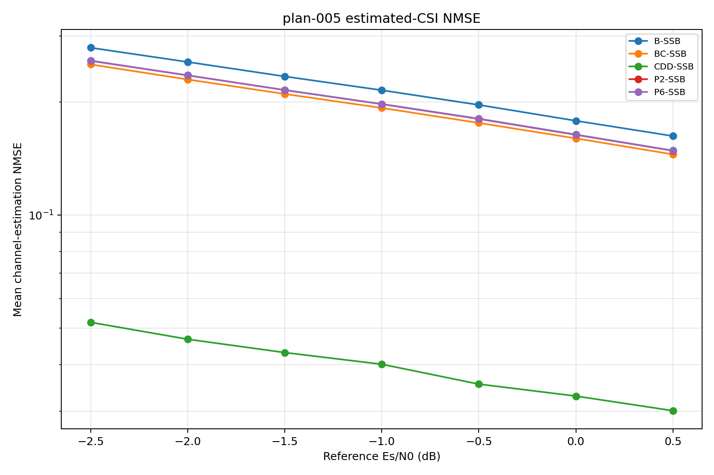

# Result 005：固定统计 CDL-C、100 ns、10° ASD 四方案 10% BLER 比较

状态：已完成

对应计划：[plan-005.md](plan-005.md)

完成日期：2026-09-22

## 1. 实际运行信息

### 1.1 运行配置与完成状态

| 项目 | 实际值 |
|---|---|
| 代码版本/状态 | 基线提交 `a89aa37041473b84d00f5c99f9c54a0ed4c6e690`；运行所用 Plan 005 实现和配置位于未提交工作树中 |
| Python/TensorFlow/Sionna | 3.11.9 / 2.15.1 / 1.0.2 |
| 正式配置 | `configs/experiments/plan-005.yaml`，SHA-256 `d886cedaa4fe6d71b319d0564f2e0a5b839e991bc8e70a55c5a694f44362a99a` |
| 展开配置 | `outputs/plan-005/run-001/full/resolved_config.yaml` |
| 输出目录 | `outputs/plan-005/run-001/full/` |
| 开始和结束时间 | 2026-09-21 23:41:20 至 2026-09-22 05:46:00（Asia/Singapore）；UTC 为 2026-09-21 15:41:20 至 21:46:00 |
| 完成状态 | 成功；7 个 SNR 点各完成 1000 个公共 drop，共 7000/7000；成功结束后无 checkpoint 残留 |
| 与 plan 的偏差 | BLER、NMSE、成对计数和元数据均按 plan 保存；全量目录未另存逐子载波 CDD 诊断 CSV，归一化证据来自同一实现的 bounded smoke 和相关测试，见第 4 节 |

正式全量运行使用主种子 `20260921`、信道 realization seed `20262001`、长期统计 seed `20261001`，绝对 drop 区间为 1000–1999。每个 SNR 下五条曲线共用传输块、信道 realization 和单位方差噪声。预扫描使用绝对 drop 0–99，未计入本结果的正式统计。

实际执行流程：

```powershell
$env:PYTHONPATH = Join-Path (Get-Location) 'src'
py -3.11 -m sib1div.cli validate-config configs/experiments/plan-005-prescan.yaml `
  --output outputs/plan-005/config-validation-prescan
.\run_plan005.ps1 -Phase diagnostic -RunId run-001
.\run_plan005.ps1 -Phase prescan -RunId run-001
.\run_plan005.ps1 -Phase prepare -RunId run-001
.\run_plan005.ps1 -Phase full -RunId run-001
```

预扫描的五条曲线均在 −2 dB 至 0 dB 之间跨越 10% BLER。`outputs/plan-005/run-001/snr-selection.json` 按 plan 预先规定的规则，将全量网格冻结为 −2.5 至 0.5 dB、间隔 0.5 dB。

Beam CDD 实际参数：

| 参数 | 实际值 |
|---|---|
| 波束数 $K$ | 2，固定 selected SSB #4 的 secondary #8/#9 |
| FFT 大小和采样率 | 2048 / 61.44 Msps |
| 循环移位采样点 | `[0, 3.5555555555555554]` |
| 对应循环移位时间 | `[0, 57.87037037037037] ns` |
| 相位 | $v_m[q]=\exp(-j2\pi qj_m/576)$，$q=0,\ldots,575$ |
| 功率归一化 | DMRS 与数据采用相同预编码；每个活动子载波归一化为单位范数 |

### 1.2 SSB PDP、CDD 人工时延与逐子载波归一化

这里的“逐子载波归一化的 PDP”不是指每个子载波各有一套传统 PDP。代码实际传给 LMMSE 的对象是由 PDP 构造的频域协方差矩阵；CDD-SSB 在普通 SSB PDP 的基础上加入已知人工时延，并把发送端逐子载波预编码归一化产生的确定性缩放纳入该协方差。

#### 1.2.1 普通 SSB PDP

固定 CDL 信道首先用 1000 个长期统计 realization 计算每条路径、每个接收分支的 TXRU 空间协方差

$$
\mathbf C_{r,\ell}=E\{\mathbf h_{r,\ell}^{H}\mathbf h_{r,\ell}\}.
$$

然后把它投影到 selected SSB 权重 $\mathbf w_{\rm SSB}$，得到每个接收分支的路径功率：

$$
P_{r,\ell}^{\rm SSB}
=
\mathbf w_{\rm SSB}^{H}\mathbf C_{r,\ell}\mathbf w_{\rm SSB}.
$$

代码中的 `ssb_pdp` 即路径时延和上述投影功率的集合 $\{(\tau_\ell,P_{r,\ell}^{\rm SSB})\}$。它转换成频域协方差：

$$
R_r[k,k']
=
\sum_\ell P_{r,\ell}^{\rm SSB}
\exp\{-j2\pi(f_k-f_{k'})\tau_\ell\}.
$$

B-SSB、P2-SSB、P6-SSB 和 BC-SSB 都使用这份 selected-SSB PDP 先验。尤其是 BC-SSB，尽管实际发送在两个 secondary beam 之间切换，接收机仍使用 parent SSB 投影得到的 PDP，而不是 secondary beam 的实际 PDP。这是本实验有意采用的公共、简化接收机先验。

#### 1.2.2 CDD-SSB 协方差

CDD-SSB 没有直接把普通 SSB PDP 交给 48-PRB LMMSE，而是将两个 CDD 分支的人工时延加入每条物理路径：

$$
\tau_{\ell,m}^{\rm eff}=\tau_\ell+\delta_m,
\qquad
[\delta_0,\delta_1]=[0,57.87037037]\ {\rm ns}.
$$

在 `cdd_ssb_pdp` 模式下，两个 CDD 分支都复制同一份 parent SSB 路径功率，即 $P_{r,m,\ell}=P_{r,\ell}^{\rm SSB}$。因此它仍然是 SSB PDP 近似，并未使用 secondary #8/#9 各自的实际 PDP。代码中另有 `cdd_per_beam_pdp` 可使用各 secondary beam 的路径功率，但 Plan 005 主曲线没有选择该先验。

在假设两个 CDD 波束分支互不相关的条件下，归一化前的频域协方差为

$$
\widetilde R_r[k,k']
=
\sum_{m=0}^{K-1}\sum_\ell
\frac{P_{r,\ell}^{\rm SSB}}{K}
\exp\left\{-j2\pi\left[
f_k(\tau_\ell+\delta_m)-f_{k'}(\tau_\ell+\delta_m)
\right]\right\}.
$$

其中 $1/K$ 来自每个 CDD 分支的 $1/\sqrt K$ 幅度。`cdd_ssb_pdp` 忽略两个 secondary beam 的交叉协方差项；代码中的 `ideal_covariance` 才会保留这些跨波束相关项。

#### 1.2.3 逐子载波归一化如何进入协方差

CDD 发射端先形成未归一化的频域预编码：

$$
\widetilde{\mathbf w}[q]
=
\frac{1}{\sqrt K}\sum_{m=0}^{K-1}
\mathbf b_m\exp(-j2\pi qj_m/576),
\qquad q=0,\ldots,575,
$$

其中 $\mathbf b_m$ 是 secondary #8/#9 的波束权重，$[j_0,j_1]=[0,1]$。由于这两个波束不严格正交，叠加后的原始功率

$$
\rho[q]=\|\widetilde{\mathbf w}[q]\|^2
$$

会随子载波变化。发送端因此执行

$$
\mathbf w[q]
=
\frac{\widetilde{\mathbf w}[q]}{\sqrt{\rho[q]}},
$$

使每个活动子载波上的预编码范数均为 1。为了使 LMMSE 先验与实际发送信道一致，CDD 频域协方差也乘入相同的已知缩放：

$$
R_r^{\rm CDD}[k,k']
=
\frac{\widetilde R_r[k,k']}{\sqrt{\rho[k]\rho[k']}}.
$$

因此，更准确的描述是“由 SSB PDP 加上已知 CDD 人工时延，并包含实际逐子载波预编码归一化因子的频域协方差”，而不是“逐子载波各自独立的 PDP”。

#### 1.2.4 LMMSE 的实际使用方式

设 DMRS 子载波集合为 $p$，完整频域协方差为 $\mathbf R$，则实现使用

$$
\widehat{\mathbf h}
=
\mathbf R_{:,p}
\left(
\mathbf R_{p,p}+\frac{\sigma_n^2}{N_{\rm DMRS}}\mathbf I
\right)^{\dagger}
\widehat{\mathbf h}_{\rm LS,p}.
$$

普通四条曲线每 2 PRB、即 24 个子载波独立执行一次 LMMSE，避免跨越预编码边界；CDD-SSB 则利用含人工时延和归一化信息的协方差，在全部 48 PRB、即 576 个子载波上联合执行。

| 项目 | `ssb_pdp` | `cdd_ssb_pdp` |
|---|---|---|
| 基础路径功率 | selected SSB 投影功率 | 同一 selected SSB 投影功率 |
| 有效路径时延 | $\tau_\ell$ | $\tau_\ell+\delta_m$ |
| CDD 分支 | 无 | 2 个，每分支功率含 $1/K$ |
| secondary beam 实际 PDP | 不使用 | 不使用 |
| 跨波束相关项 | 不适用 | 忽略，假定两个分支互不相关 |
| 子载波归一化 | 无额外 CDD 处理 | 协方差除以 $\sqrt{\rho[k]\rho[k']}$ |
| LMMSE 窗口 | 2 PRB / 24 子载波 | 48 PRB / 576 子载波 |

这一实现差异意味着：Plan 005 中 CDD-SSB 的 NMSE 和 BLER 收益是“CDD 预编码、已知人工时延、逐子载波归一化感知以及 48-PRB 匹配 LMMSE”的整体收益，不能全部解释为发射 CDD 本身的收益。对应实现位于 `src/sib1div/channel/cdl.py` 的长期路径协方差构造、`src/sib1div/receiver/estimation.py` 的 `frequency_covariance()` 和 `independent_cdd_frequency_covariance()`、`src/sib1div/schemes/precoding.py` 的 `build_precoder()`，以及 `src/sib1div/sim/engine.py` 的 `_prior_covariances()`。

## 2. BLER 结果

以下均为原始计数，95% 区间为 Wilson 区间。

| 方案 | SNR/dB | 误块数 | 总块数 | BLER | 95%区间下限 | 95%区间上限 |
|---|---:|---:|---:|---:|---:|---:|
| B-SSB | -2.5 | 406 | 1000 | 0.406 | 0.3760 | 0.4367 |
| P2-SSB | -2.5 | 337 | 1000 | 0.337 | 0.3084 | 0.3669 |
| P6-SSB | -2.5 | 345 | 1000 | 0.345 | 0.3162 | 0.3750 |
| BC-SSB | -2.5 | 312 | 1000 | 0.312 | 0.2840 | 0.3414 |
| CDD-SSB | -2.5 | 207 | 1000 | 0.207 | 0.1830 | 0.2332 |
| B-SSB | -2.0 | 318 | 1000 | 0.318 | 0.2899 | 0.3475 |
| P2-SSB | -2.0 | 264 | 1000 | 0.264 | 0.2376 | 0.2922 |
| P6-SSB | -2.0 | 261 | 1000 | 0.261 | 0.2347 | 0.2891 |
| BC-SSB | -2.0 | 233 | 1000 | 0.233 | 0.2079 | 0.2602 |
| CDD-SSB | -2.0 | 146 | 1000 | 0.146 | 0.1255 | 0.1692 |
| B-SSB | -1.5 | 251 | 1000 | 0.251 | 0.2251 | 0.2788 |
| P2-SSB | -1.5 | 180 | 1000 | 0.180 | 0.1574 | 0.2050 |
| P6-SSB | -1.5 | 183 | 1000 | 0.183 | 0.1603 | 0.2082 |
| BC-SSB | -1.5 | 179 | 1000 | 0.179 | 0.1565 | 0.2040 |
| CDD-SSB | -1.5 | 111 | 1000 | 0.111 | 0.0930 | 0.1320 |
| B-SSB | -1.0 | 188 | 1000 | 0.188 | 0.1650 | 0.2134 |
| P2-SSB | -1.0 | 121 | 1000 | 0.121 | 0.1022 | 0.1427 |
| P6-SSB | -1.0 | 120 | 1000 | 0.120 | 0.1013 | 0.1416 |
| BC-SSB | -1.0 | 126 | 1000 | 0.126 | 0.1069 | 0.1480 |
| CDD-SSB | -1.0 | 79 | 1000 | 0.079 | 0.0638 | 0.0974 |
| B-SSB | -0.5 | 137 | 1000 | 0.137 | 0.1171 | 0.1597 |
| P2-SSB | -0.5 | 74 | 1000 | 0.074 | 0.0594 | 0.0919 |
| P6-SSB | -0.5 | 82 | 1000 | 0.082 | 0.0666 | 0.1006 |
| BC-SSB | -0.5 | 96 | 1000 | 0.096 | 0.0793 | 0.1158 |
| CDD-SSB | -0.5 | 61 | 1000 | 0.061 | 0.0478 | 0.0776 |
| B-SSB | 0.0 | 100 | 1000 | 0.100 | 0.0829 | 0.1202 |
| P2-SSB | 0.0 | 44 | 1000 | 0.044 | 0.0329 | 0.0586 |
| P6-SSB | 0.0 | 42 | 1000 | 0.042 | 0.0312 | 0.0563 |
| BC-SSB | 0.0 | 60 | 1000 | 0.060 | 0.0469 | 0.0765 |
| CDD-SSB | 0.0 | 36 | 1000 | 0.036 | 0.0261 | 0.0494 |
| B-SSB | 0.5 | 76 | 1000 | 0.076 | 0.0611 | 0.0941 |
| P2-SSB | 0.5 | 28 | 1000 | 0.028 | 0.0194 | 0.0402 |
| P6-SSB | 0.5 | 30 | 1000 | 0.030 | 0.0211 | 0.0425 |
| BC-SSB | 0.5 | 38 | 1000 | 0.038 | 0.0278 | 0.0517 |
| CDD-SSB | 0.5 | 26 | 1000 | 0.026 | 0.0178 | 0.0378 |

主 BLER 曲线：



### 2.1 10% BLER 门限

除 B-SSB 恰在 0 dB 得到 BLER=0.1 外，其余门限均按 plan 在原始 BLER 括区两端对 $\log_{10}(\mathrm{BLER})$ 随 SNR 作线性插值。这里的“相对 Baseline 增益”定义为 Baseline 门限减去该方案门限；正值表示达到相同 BLER 所需 SNR 更低。

| 方案 | 原始点括区/dB | 插值门限/dB | 相对 B-SSB 增益/dB |
|---|---:|---:|---:|
| B-SSB | `[0.0, 0.0]` | 0.00 | 0.00 |
| P2-SSB | `[-1.0, -0.5]` | -0.81 | 0.81 |
| P6-SSB | `[-1.0, -0.5]` | -0.76 | 0.76 |
| BC-SSB | `[-1.0, -0.5]` | -0.58 | 0.58 |
| CDD-SSB | `[-1.5, -1.0]` | -1.35 | 1.35 |

门限是由相邻原始采样点得到的点估计，没有另行构造门限置信区间。P2-SSB 与 P6-SSB 仅相差约 0.05 dB，且相邻点的 BLER 置信区间高度重叠，本实验不能支持二者存在确定性能差异的结论。

## 3. 波束、信道估计和实现检查

### 3.1 长期波束功率

- 1000 个长期统计 realization 得到 selected SSB #4，功率为 443.9263（26.4731 dB），是 8 个 SSB 中唯一最大者；次强 SSB #3 比其低 6.0028 dB。
- selected SSB 的两个子波束为 secondary #8/#9，功率分别为 582.4079 和 395.3568，在全部 secondary beam 中排名第 1 和第 2；#9 比全局峰值低 1.6824 dB，满足“不低于峰值 3 dB”的条件。
- 变换后的功率加权 mean AoD 为 6.25°、RMS ASD 为 10.00°、mean ZoD 为 104.4733873545822°，均与 plan 一致。
- 冻结码本 SHA-256 为 `3142396469049e843e8018bc5596152aa70d53e46d18b406879b52cf54638259`。



### 3.2 信道估计 NMSE



从 −2.5 dB 到 0.5 dB，B-SSB 的平均 NMSE 从 0.2793 降至 0.1624；P2/P6-SSB 从约 0.258 降至约 0.148；BC-SSB 从 0.2521 降至 0.1452；CDD-SSB 从 0.05182 降至 0.03013。所有方案的 NMSE 随 SNR 提升持续下降，没有观察到固定误差地板。CDD-SSB 使用含已知 CDD 人工时延和逐子载波归一化的 PDP 及 48-PRB LMMSE 窗口，因此其 NMSE 与其他方案的 2-PRB SSB-PDP 估计器并非只差预编码，不能把全部 BLER 收益单独归因于波束 CDD。

### 3.3 实现和数据完整性

- 正式输出含 35 行 BLER、35 行 NMSE 和 70 行成对错误计数；未发现 NaN 或 Inf。
- `paired_counts.csv` 对每个 SNR 和每对曲线都记录 1000 个共同 block，且每行 `n00+n01+n10+n11=1000`，与公共随机样本设计一致。
- CDD 实际循环移位 `[0, 3.5555555555555554]` 样点、对应 `[0, 57.87037037037037] ns`，已冻结在展开配置和运行元数据中。
- 同一预编码实现的 bounded smoke 保存了 576 个活动子载波的诊断；归一化功率范围为 0.9999999999999990–1.0000000000000016，最大绝对误差 $1.55\times10^{-15}$。正式全量目录没有另存该诊断 CSV，这是证据留存上的限制，不影响 BLER/NMSE 原始计数。
- 2026-09-22 重新执行 `tests/test_cdl_config.py`、`tests/test_cdl.py`、`tests/test_sim.py`、`tests/test_adaptive.py` 和 `tests/test_plan005.py`：19 项通过，14 条均为 Matplotlib/PyParsing 弃用警告。
- 正式配置与预扫描配置的验证日志均显示成功；全量标准错误日志仅含 TensorFlow 信息和弃用警告，没有异常终止或求解失败记录。

本次没有生成 Perfect CSI 曲线；这是冻结配置中 `perfect_csi_curves: []` 的预定行为，不是运行遗漏。

## 4. 结果是否有效

- [x] 相关单元测试、配置验证和 bounded smoke 通过。
- [x] 波束选择和角度统计满足 plan 的进入条件。
- [x] 全量每个 SNR 恰好完成 1000 个公共 drop，预扫描与全量绝对 drop 区间不重叠。
- [x] 五条曲线均有 10% BLER 两侧的原始采样点，B-SSB 在 0 dB 恰好等于 10%。
- [x] 曲线、CSV、元数据和日志一致，未发现 NaN、异常退出或固定 NMSE 误差地板。
- [x] CDD 循环移位与 plan 一致；逐子载波归一化由配置、实现测试和 bounded smoke 验证。
- [x] 所有已知偏差和证据限制均已记录。

有效性结论：

> **有效。** 本次结果满足 Plan 005 预先规定的主要有效性条件，可用于报告该固定 CDL-C 统计、100 ns DS、10° ASD 和当前 LMMSE 接收机配置下的 10% BLER 门限。正式目录未单独保存 CDD 逐子载波诊断 CSV，后续正式实验应把该诊断直接写入对应 run 目录，以加强单次运行的可追溯性。

## 5. 结论

1. 在本次固定统计 CDL-C 场景中，四种分集方案相对 B-SSB 均降低了达到 10% BLER 所需的参考 SNR。点估计收益依次为 CDD-SSB 1.35 dB、P2-SSB 0.81 dB、P6-SSB 0.76 dB、BC-SSB 0.58 dB。
2. CDD-SSB 在全部七个 SNR 点均取得最低 BLER，并且 10% 门限比次优的 P2-SSB 低约 0.54 dB。它同时采用 CDD-aware PDP 和 48-PRB LMMSE 窗口，结论应表述为“CDD 方案与其匹配接收机的整体收益”，不能仅解释为发射预编码收益。
3. P2-SSB 与 P6-SSB 的门限估计基本相同；1000 drop/点不足以可靠区分约 0.05 dB 的差异。BC-SSB 在本门限附近优于 Baseline，但弱于两种 Pol-cycling。
4. 所有 NMSE 曲线随 SNR 单调下降。CDD-SSB 的 NMSE 明显较低，说明匹配的宽带协方差/估计窗口是其链路性能的一部分。
5. 这些结论只适用于固定 CDL-C ray/coupling/角度统计、仅重采样初始相位、无路径损耗和阴影衰落、固定 selected SSB 的条件；不能直接外推到 UMa 几何 drop、移动 UE、SSB 选择误差或其他 DS/ASD。

## 6. 输出和复现

- BLER 数据：`outputs/plan-005/run-001/full/bler.csv`
- BLER 图：`outputs/plan-005/run-001/full/bler.png`
- NMSE 数据：`outputs/plan-005/run-001/full/nmse.csv`
- NMSE 图：`outputs/plan-005/run-001/full/nmse.png`
- 成对错误计数：`outputs/plan-005/run-001/full/paired_counts.csv`
- 运行元数据：`outputs/plan-005/run-001/full/run_metadata.json`
- 展开配置：`outputs/plan-005/run-001/full/resolved_config.yaml`
- 环境信息：`outputs/plan-005/run-001/full/environment.json`
- 运行日志：`outputs/plan-005/run-001/full/run.log`
- 完整标准输出/错误：`outputs/plan-005/run-001/full-process.stdout.log`、`outputs/plan-005/run-001/full-process.stderr.log`
- 波束诊断：`outputs/plan-005/run-001/beam-rsrp/beam_rsrp.csv`、`beam_rsrp_summary.json` 和 `beam_rsrp.png`
- SNR 选择证据：`outputs/plan-005/run-001/snr-selection.json`
- CDD 归一化 smoke：`outputs/plan-005/smoke/cdd_precoder_diagnostics.csv`

复现命令：

```powershell
.\run_plan005_full.ps1 -RunId run-002
```

该命令先运行 Plan 005 相关测试和正式配置验证，再启动全量仿真。若仅需按原分阶段流程复现，则依次执行第 1 节列出的 diagnostic、prescan、prepare 和 full 命令，并使用新的 run ID 避免覆盖 `run-001`。
